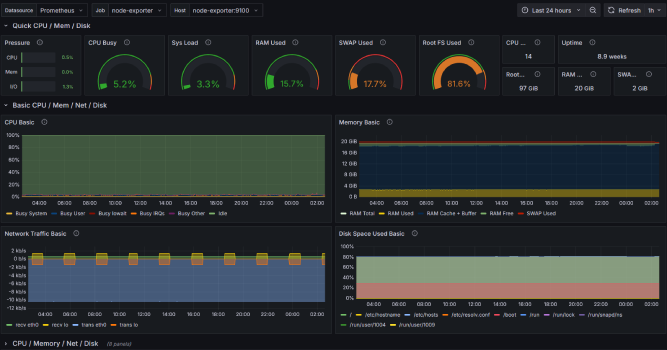
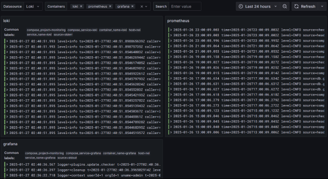

# Like CCTV, but for the server 📸🚨




This repository contains a base setup for monitoring resources, application health and uptime of a server. It includes web interfaces for performing common maintenance tasks, like managing running containers, viewing logs, etc.

Note that the current configuration is meant to be used on standalone _Linux_ server hosts and not in any sort of cluster node from management systems like Kubernetes or Docker Swarm.

We try to maintain the simplity of the configuration as much as possible seeing as we don't have any need for orchestration level workflows and monitoring.

**Uptime-Kuma** is a service that provides a web interface for monitoring the status of your services. It can be used to check if your services are up and running through a variety of request options, and it can also send alerts if they go down.

**Prometheus** is a time series database, that in our case is used for monitoring system resources. It needs a data feed for the system resources, which is provided by the **node-exporter** service. Prometheus can also be used to collect metrics for individual applications using OpenTelemetry (OTL), among others, but we do not currently use this feature in our setup.

**Grafana** provides a web interface for visualizing the data from **Prometheus** (which in turn gets it from _node-exporter_). It also provides an alert system based on user rules that can act through SMTP, Webhooks, etc. This configurations comes with a **provisioned dashboard** for system resources, directly configured to display the information from _node-exporter_. There is also a ~~**provisioned alert workflow**~~ (removed because it was broken, needs to be reimplemented) that sends an email through SMTP when the CPU, RAM or disk usage reach certain thresholds.

**Bugsink** is a lightweight **Sentry** alternative, it is compatible with the _Sentry SDKs_ and can be used to track errors sent by _sentry-ready_ applications. It provides a web interface for viewing the errors and their stack traces, as well as a notification system that can send alerts through email, Slack, etc.

**Portainer** is a web interface for managing Docker containers. It provides a simple way to view the running containers, their logs, and their resource usage. It also provides a way to quickly manage the containers, such as starting and stopping them.

## Requirements 📋

- **Linux**
- Docker Compose 2.24.0+

## Usage 🚀

- Clone the repository and open a terminal **inside** it.

- Create a `.env` file based on the `.env.example` file.

- Start the docker compose:

  ```shell
  docker compose up --force-recreate
  ```

- Access **Uptime-Kuma** at the port you set in the `.env` file, the first user will get a promp to create an admin account.

- Access **Grafana** at the port you set in the `.env` file, the default login is  `admin / admin`, which you will then be prompted to forcibly change.

- Access **Bugsink** at the port you set in the `.env` file, the default login is the super user that was also set in the `.env` file.

- Access **Portainer** at the port you set in the `.env` file, the default login is `admin / admin`, which you will then be prompted to forcibly change.

## Notes 📝

- To update any of the docker services simply bump the versions in the `image` fields of the `docker-compose.yaml` file and run the `docker compose up --force-recreate` command to restart them.

- Always beware of **breaking changes** when updating to the latest versions! Look at the update notes of each component to see if there are any migration steps required when upgrading.
